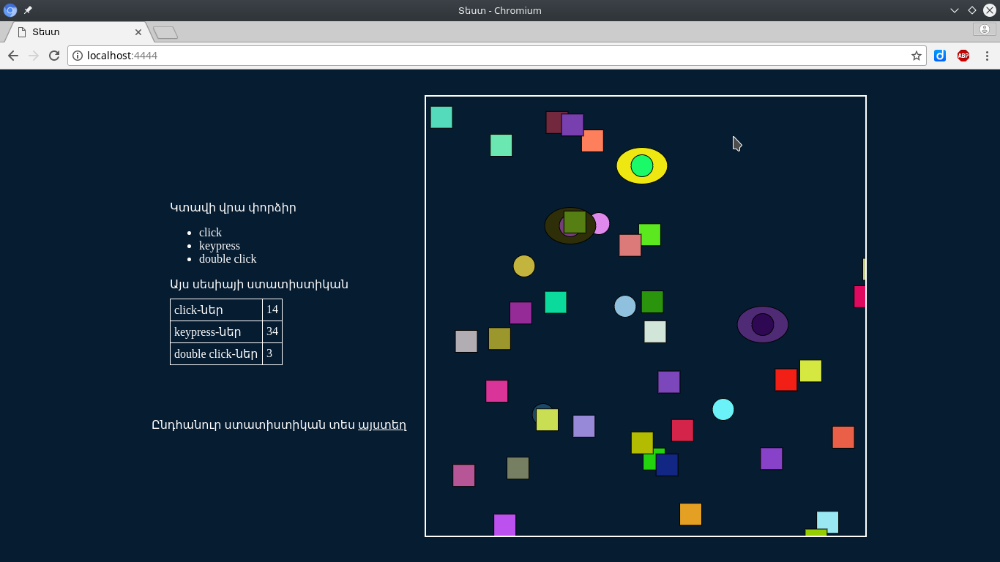

# prog3-example-socket-file-server

## installation
```
git clone https://github.com/hanumanum/prog3-example-socket-file-server
cd prog3-example-socket-file-server
npm update
node server.js
```

## open

sandbox
http://localhost:4444/

statistics
http://localhost:4444/stats.html

## screenshot

